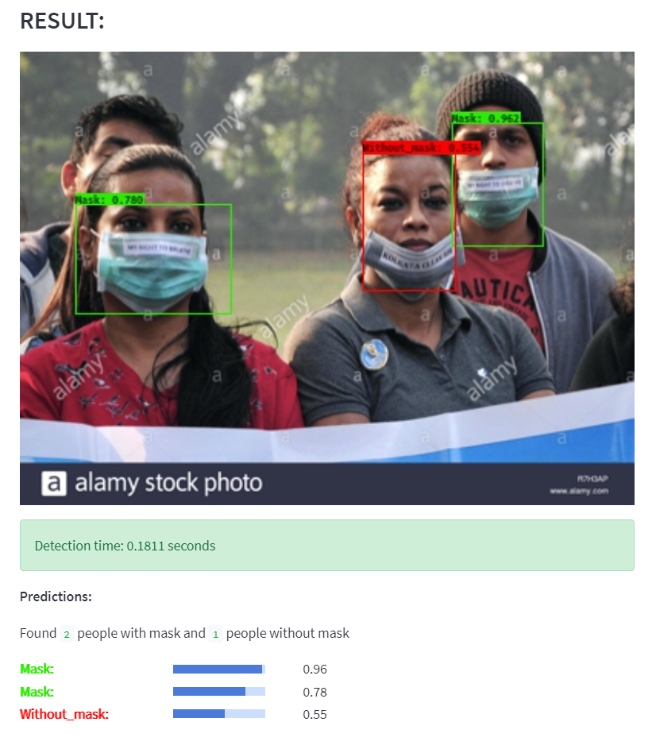

# **Web-app: COCO objects detection and Mask detection with YOLOv3 and Streamlit**

### **Local usage:**
* Download [yolov3.weights](https://pjreddie.com/media/files/yolov3.weights)
* Download [yolov3_custom.weights](https://drive.google.com/file/d/1qILjpE3s3P9a3eGuX64tT_K6o8YyeDca/view?usp=sharing)
* Put these weight files in folder **weights**
* Run ```streamlit run app.py``` in terminal and this web-app will start on your browser
* Choose detection type and upload image to detect.


### **For training custom objects: Mask and Without_mask (on Google Colab)**
* Clone darknet from​ https://github.com/pjreddie/darknet
* Delete all content in **darknet/cfg** and **darknet/data**
* Copy 2 folder **data** and **cfg** from **for custom training** to folder darknet \
(You can change the configs in yolov3_custom.cfg for better result)
* Zip folder darknet, upload **darknet.zip** and **train_custom.ipynb** to google drive folder
* Make folder name **backup** in that same gdrive folder
* Run the notebook on google colab to get the weight in **backup**
* Change weight's name to **yolov3_custom.weights**, download and put it in folder **weights**

Dataset: https://www.kaggle.com/alexandralorenzo/maskdetection

### **Demo**



